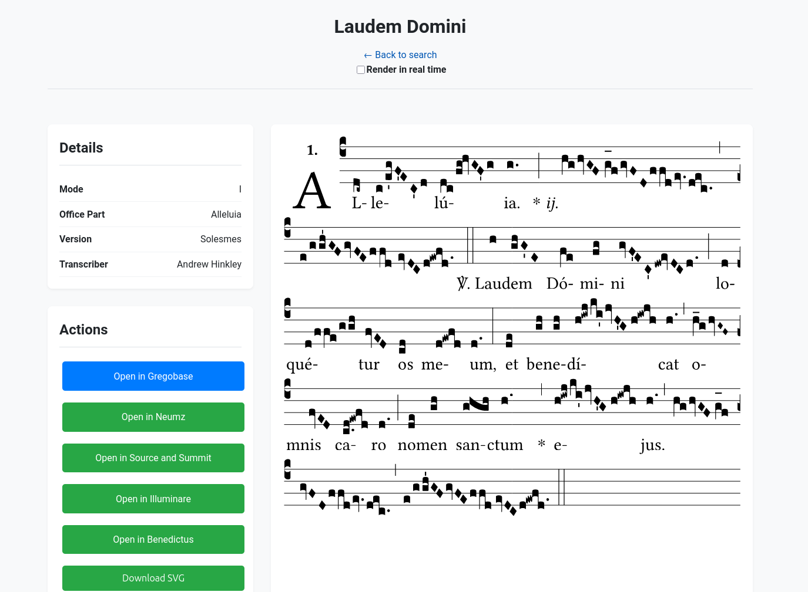

# GregoSearch

[Read this in Portuguese (pt-br)](docs/pt-br.md)

GregoSearch is a modern and powerful search interface for [GregoBase](http://gregobase.selapa.net), one of the largest databases of Gregorian chant scores.

The goal of this project is to offer an enhanced user experience when searching GregoBase's extensive collection, providing robust filters and a clean, reactive interface to help musicians, liturgists, scholars, and enthusiasts find and work with Gregorian chant scores efficiently.

**Access the web application at: [busca.liturgiacantada.com.br](https://busca.liturgiacantada.com.br)**

## Images

## Features

*   **Search by Title (Incipit):** Quickly find chants by their initial text.
*   **Advanced Filters:** Refine your search by **Part of the Office** (e.g., Introit, Alleluia, Hymn) and by **Mode** (e.g., Mode I, Mode VIII).
*   **Integrated Viewing:** View the chant score directly within the interface.
*   **Actions and Export:**
    *   Open the original score directly in GregoBase.
    *   View on other platforms like Neumz and Source and Summit.
    *   Download the score as a vector image (SVG).
    *   Download or copy the notation source code in **GABC** format.
    *   Access tools to clean and format GABC code.

## How to Contribute

Contributions to improve GregoSearch are very welcome. Feel free to open an *issue* to report a bug or suggest a new feature, or a *pull request* with code improvements.