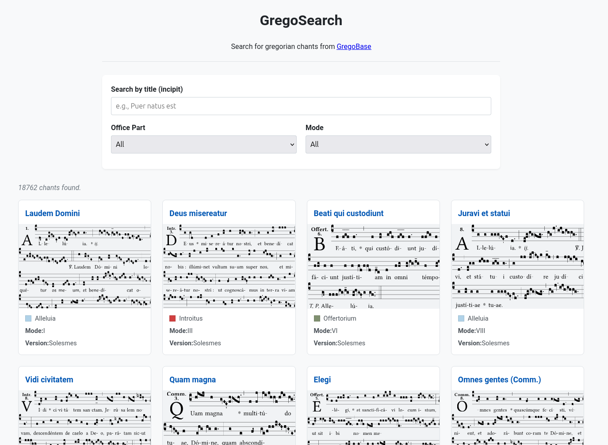
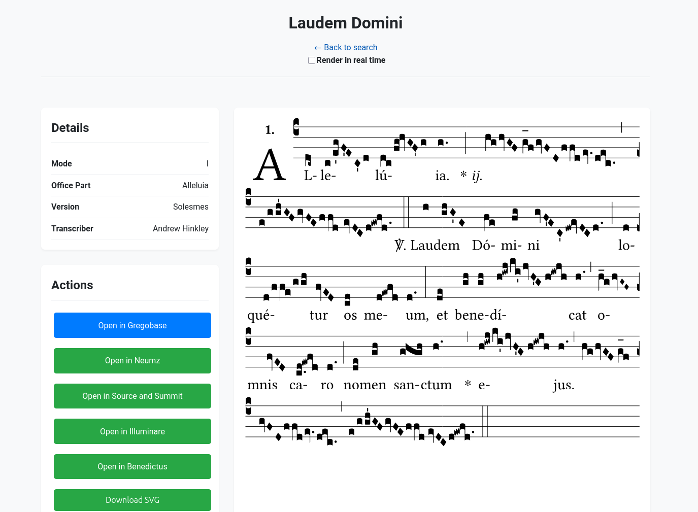

# GregoSearch

GregoSearch é uma interface de busca moderna e poderosa para o [GregoBase](http://gregobase.selapa.net), um dos maiores bancos de dados de partituras de canto gregoriano.

O objetivo deste projeto é oferecer uma experiência de usuário aprimorada ao pesquisar o extenso acervo do GregoBase, fornecendo filtros robustos e uma interface limpa e reativa para ajudar músicos, liturgistas, estudiosos e entusiastas a encontrar e a trabalhar com partituras de cantos gregorianos de forma eficiente.

**Acesse a aplicação web em: [busca.liturgiacantada.com.br](https://busca.liturgiacantada.com.br)**

## Imagens

## Funcionalidades

*   **Busca por Título (Incipit):** Encontre cantos rapidamente pelo seu texto inicial.
*   **Filtros Avançados:** Refine sua busca por **Parte do Ofício** (e.g., Introito, Alleluia, Hino) e por **Modo** (e.g., Modo I, Modo VIII).
*   **Visualização Integrada:** Visualize a partitura do canto diretamente na interface.
*   **Ações e Exportação:**
    *   Abra a partitura original diretamente no GregoBase.
    *   Visualize em outras plataformas como Neumz e Source and Summit.
    *   Faça o download da partitura como imagem vetorial (SVG).
    *   Faça o download ou copie o código-fonte da notação no formato **GABC**.
    *   Acesse ferramentas para limpar e formatar o código GABC.

## Como Contribuir

Contribuições para melhorar o GregoSearch são muito bem-vindas. Sinta-se à vontade para abrir uma *issue* para relatar um bug ou sugerir uma nova funcionalidade, ou um *pull request* com melhorias no código.
